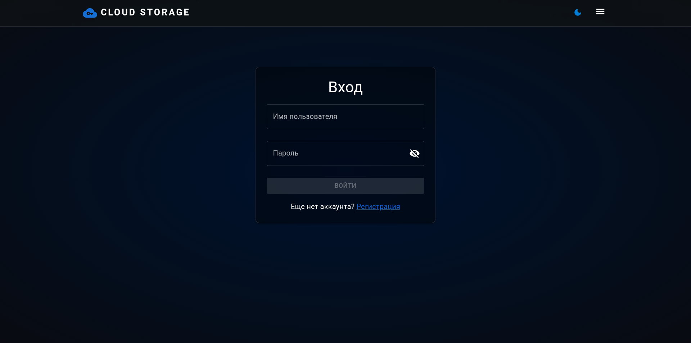
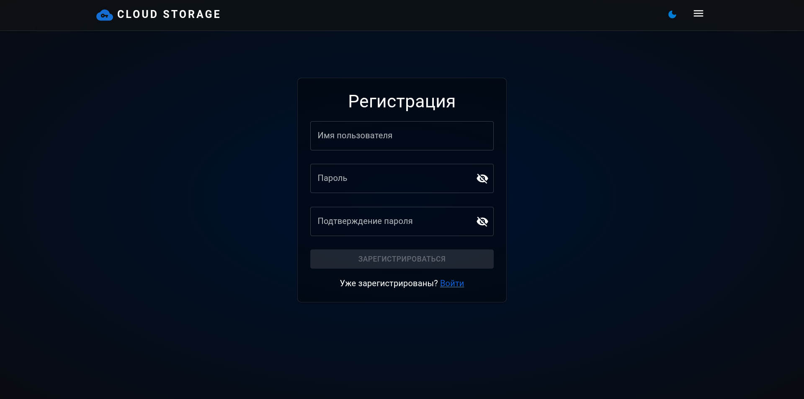
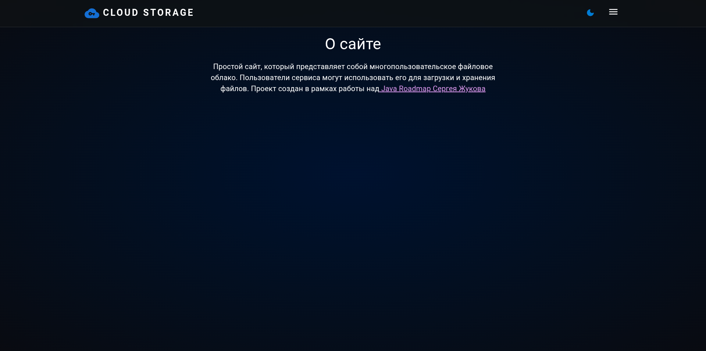
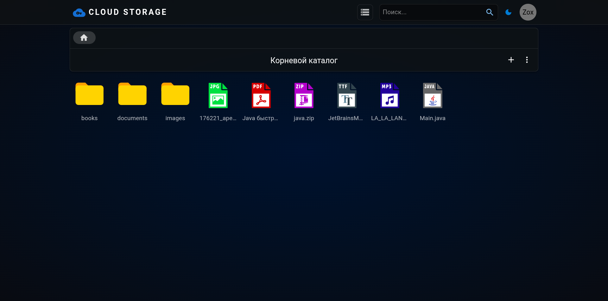
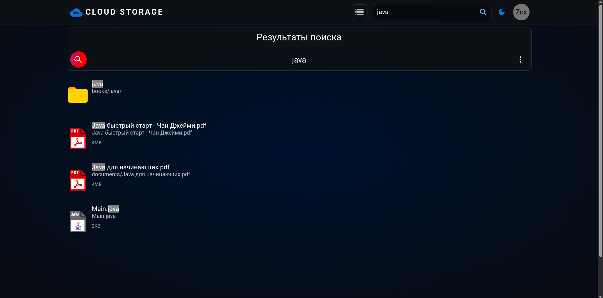
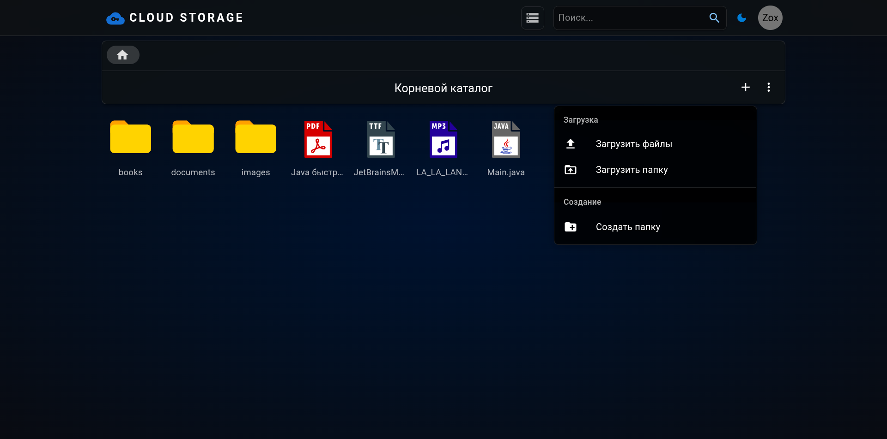
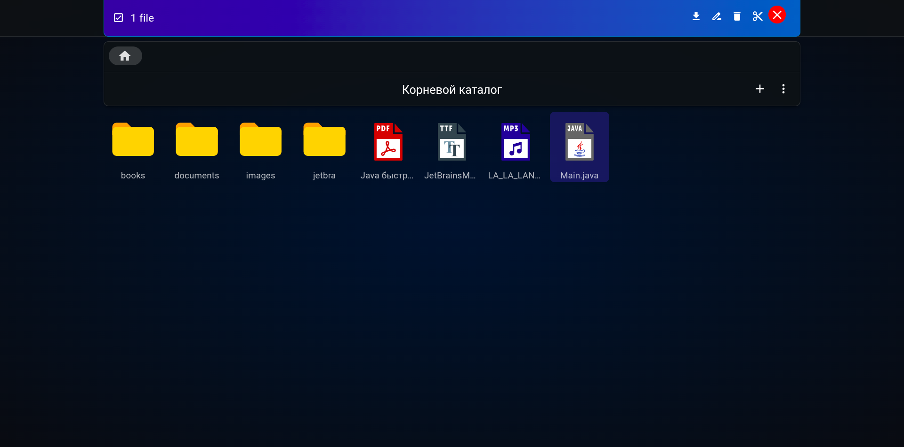

# ☁️ Cloud File Storage

[](https://www.java.com/)
[](https://spring.io/projects/spring-boot)


Многопользовательское облачное файловое хранилище — учебный аналог **Google Drive**, разработанный на Java Spring Boot.  
Проект позволяет пользователям регистрироваться, авторизовываться и управлять своими файлами и папками: загружать, скачивать, удалять, переименовывать, перемещать и искать.

---

## ✨ Функционал
- 👤 Регистрация, авторизация, logout
- 📂 Создание, удаление, переименование и перемещение папок/файлов
- 📑 Загрузка и скачивание папок/файлов
- 🔍 Поиск по файлам и папкам
- 🔒 Сессии и авторизация через Spring Security + Redis
- 📡 REST API с документацией в Swagger UI

---

## 🛠️ Технологии

### Backend
- ☕ **Java 21**
- ⚡ **Spring Boot** (Web, Security, Data JPA, Validation)
- 🗄️ **PostgreSQL** + **Liquibase** (миграции БД)
- 🗃️ **Redis** + **Spring Session** (хранение сессий)
- 📦 **MinIO** (S3-совместимое файловое хранилище)
- 🔄 **MapStruct** (маппинг DTO ↔ Entity)
- 📝 **Lombok** (сокращение шаблонного кода)
- 📖 **Springdoc OpenAPI (Swagger UI)** (документация API)

### Frontend
- ⚛️ **React** (SPA)
- 🎨 **Bootstrap 5**

### DevOps & Тестирование
- 🐳 **Docker & Docker Compose**
- 🧪 **JUnit 5** + **Spring Boot Test**
- 🧰 **Testcontainers**

---

## 🚀 Запуск проекта

### 📦 Через Docker Compose
```
# Клонировать репозиторий
git clone https://github.com/Zoxid-Iskandarov/cloud-file-storage.git
cd cloud-file-storage

# Запуск 
docker compose up -d

# Остановка
docker compose down
```

✅ **Сервисы будут доступны по адресам:**

- 💻 **Frontend:** http://localhost:80

- 📑 **Swagger UI:** http://localhost:8080/swagger-ui.html

- 📦 **MinIO UI:** http://localhost:9001

---

## 📡 REST API

### 🔐 Авторизация и пользователи
| Метод | Эндпоинт             | Описание                         |
|-------|----------------------|----------------------------------|
| POST  | `/api/auth/sign-up`  | Регистрация нового пользователя  |
| POST  | `/api/auth/sign-in`  | Вход в систему                   |
| POST  | `/api/auth/sign-out` | Выход из системы                 |
| GET   | `/api/user/me`       | Получение данных текущего пользователя |

### 📂 Работа с папками
| Метод | Эндпоинт                     | Описание                         |
|-------|------------------------------|----------------------------------|
| GET   | `/api/directory?path={path}` | Получение содержимого папки      |
| POST  | `/api/directory?path={path}` | Создание новой папки             |

### 📑 Работа с файлами
| Метод | Эндпоинт                                 | Описание                               |
|-------|------------------------------------------|----------------------------------------|
| POST  | `/api/resource?path={path}`              | Загрузка одного или нескольких файлов  |
| GET   | `/api/resource/download?path={path}`     | Скачивание файла или папки             |
| GET   | `/api/resource/move?from={from}&to={to}` | Перемещение или переименование ресурса |
| GET   | `/api/resource/search?query={query}`     | Поиск файлов и папок по названию       |
| DELETE| `/api/resource?path={path}`              | Удаление папки/ресурса                 |

---

## 🖼️ Скриншоты

### 🔐 Аутентификация

<div align="center">
  
</div>

<div align="center">
  
</div>

### 📂 Файловое хранилище

<div align="center">
  
</div>

<div align="center">
  
</div>

<div align="center">
  
</div>

<div align="center">
  
</div>

<div align="center">
  
</div>
